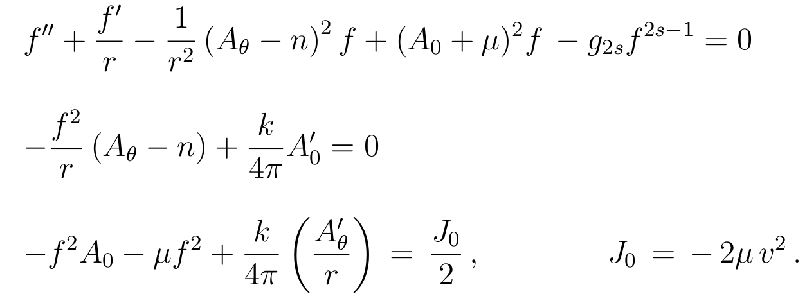

# Numerical calculations for [arXiv.1912.11321](https://arxiv.org/abs/1912.11321)

---

## About

This repository contains the code used for the numerical analysis performed in [arXiv.1912.11321](https://arxiv.org/abs/1912.11321).

The numerics was performed by computing solutions of the system of linear equations in __MATLAB__.



These solutions are then used to calculate the various properties these solutions have (e.g. _total energy_, _radius_, _total flux_, _peak value of B_, _etc_) 


## User Guide

### Disclaimer

I have only run this on a Unix like environment so if you attempt to run this on Windows it might not work since the path declaration is not consistent with Windows standard. I can, of course, fix this, upon request.

### Running the code

When in __MATLAB__, go to the `matlab` directory and run 

`dimensionless` (or `dimensionless_Sixth_order.m` if you would like to solve the equations with a 6th order monomial)

This will produce a plot of the vortex profiles and write down their respective characteristics on a file called `data/Dimensionless_Data.txt` (or `data/Dimensionless_6thorder_Data.txt` in the 6th order monomial case)

The characteristics are recorded to 5 decimal points on a separate line for each run in the following order:

|1|  2  |   3     |     4     |   5  |  6  |    7    |   8   |
|-|:---:|:-------:|:---------:|:----:|:---:|:-------:|:-----:|
|_n_|_alpha_|_totalflux_|_totalenergy_|_radius_|_A0max_|_maxBfield_|_residue_|

In addition, the data for each profile is recorded in a file named `data/solutions/dimensionless_solution_nVALUEOFn_alphaVALUEOFalpha.csv`. The entries in those files are as follows:


|1|  2  |   3     |     4     |   5  |  6  |    7    |
|:-----------:|:----------:|:--------:|:--------------:|:--------------:|:----------:|:----------:|
|Radial Position|Magnetic Field|Scalar Field|Electric Potential|Magnetic Potential|Electric Field|Energy Density|

### Set parameters

One can adjust the parameters from the relevant section in the `matlab/dimensionless.m` file.

```
% Parameter declaration:
%----------------------------------------
    global n;
    global alpha;
    global zero;
    n=-20;       % Set flux number.
    alpha=4;     % Set dimensionless coupling.
    zero=0.01;   % Low cutoff point for the bvp solver.
    infty=22;    % High cutoff point for the bvp solver.
%----------------------------------------
```
### Profile plots

Creating plot image files is done in _python_.
In order to turn these data files into plots, first add the solution you would like to plot at the start of the `solution_plot_dimensionless.py` file as follows

```
your_data = np.genfromtxt('data/solutions/dimensionless_solution_nVALUEOFn_alphaVALUEOFalpha.csv', delimiter=',', names=['x', 'B', 'f', 'A0', 'Atheta','A0`', 'energy'])
```

If, for example, you'd like to plot the magnetic field for your choice of parameters, simply amend the relevant section along with title, legend and filename:

```
# Plot B:
# {{{
#----------------------------------------
ax=plt.gca()
plt.title('Magnetic Field Profiles for n=-1', FontSize=25)
plt.plot(data_n_1_param1['x'], data_n_1_param1['B'], '-',LineWidth=1.6,c='b')
plt.plot(data_n_1_param2['x'], data_n_1_param2['B'], '--',LineWidth=1.6,c='r')
plt.plot(data_n_1_param3['x'], data_n_1_param3['B'], '-',LineWidth=1.6,c='g')
plt.plot(data_n_1_param4['x'], data_n_1_param4['B'], '-',LineWidth=1.6,c='m')
plt.plot(data_n_1_param5['x'], data_n_1_param5['B'], '-',LineWidth=1.6,c='tab:orange')
plt.plot(your_data['x'], your_data['B'], '-',LineWidth=1.6,c='tab:cyan')
plt.xlabel(r'$\hat{r}$',FontSize=20)
plt.ylabel(r'$\hat{B}(\hat{r})$',FontSize=20)
ax.set_ylim(bottom=-1.02)
ax.set_xlim(left=0,right=30)
ax.legend((r'$\alpha =1$', r'$\alpha =2$',r'$\alpha =3$',r'$\alpha =4$',r'$\alpha =5$'))
plt.tight_layout()
plt.savefig('python-plots/solution_plots/solution_dimensionless_nVALUEOFn_Bvsalpha')
plt.clf()
#----------------------------------------
# }}}
```


### Plots of the various characteristics

The plots for the various characteristics are produced in a similar way, again in _python_. You can either use the data from `data/Dimensionless_Data.txt` (or `data/Dimensionless_6thorder_Data.txt`) or you can copy specific lines from that file, that correspond to solutions you have double checked, into a separate file. Then again you include the data in the `alphapythonplot.py` file as follows:

```
your_characteristic_data = np.genfromtxt('data/your_data_file.txt', delimiter=' ', names=['n', 'alpha', 'flux', 'energy', 'radius', 'A0', 'peakB', 'residue'])
```

And from here on, it's up to _you_ how you will use that data. I hope this is useful!
